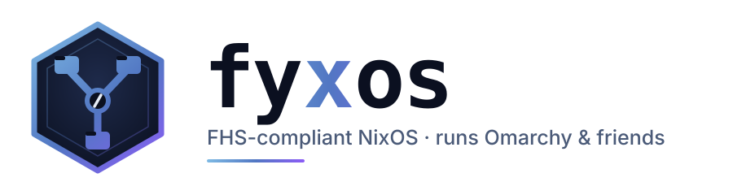
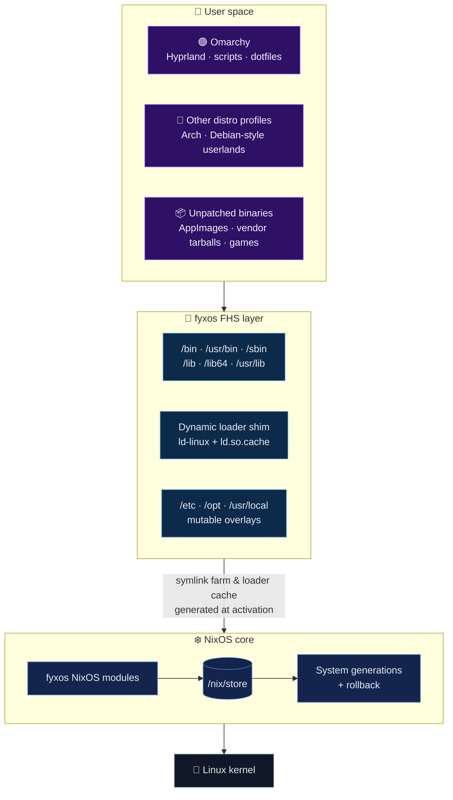
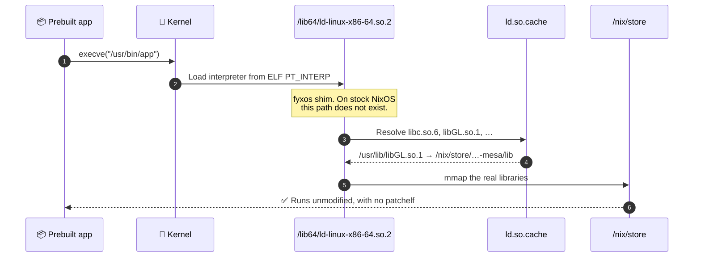
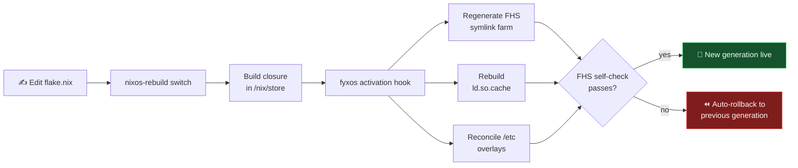
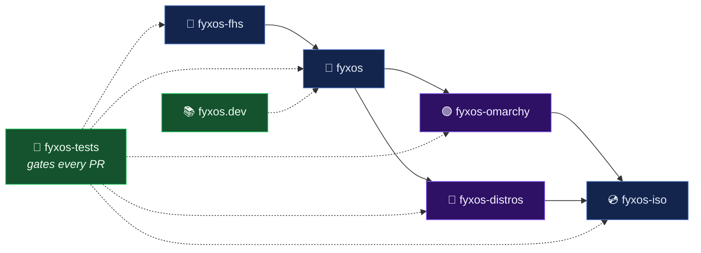

<div align="center">

<picture>
  <source media="(prefers-color-scheme: dark)" srcset="assets/fyxos-banner-dark.svg">
  <source media="(prefers-color-scheme: light)" srcset="assets/fyxos-banner-light.svg">
  
</picture>

### NixOS reproducibility, with an ordinary `/usr/bin`.

**fyxos** is NixOS made **FHS-compliant**, so [Omarchy](https://omarchy.org) and other distributions' userlands
run on a declarative, rollback-safe base, without patchelf or wrapper scripts.

<br>

[](https://nixos.org)
[](https://refspecs.linuxfoundation.org/FHS_3.0/fhs/index.html)
[](https://omarchy.org)
[](https://hyprland.org)

[**Why**](#-why-fyxos) · [**Architecture**](#-architecture) · [**Repositories**](#-the-org-at-a-glance) · [**Testing**](#-how-we-test) · [**Quick start**](#-quick-start) · [**Contributing**](#-contributing)

</div>

---

## ✨ Why fyxos?

NixOS is excellent at reproducibility, but software written for "normal" Linux breaks on it. Prebuilt binaries look for
`/lib64/ld-linux-x86-64.so.2`, scripts start with `#!/bin/bash`, and installers write to `/usr/local`, `/opt`, and `/etc`.
On stock NixOS none of those paths behave the way the software expects.

Opinionated distributions like **Omarchy** depend on those paths: they ship shell scripts, dotfiles, and binaries that assume
a standard Filesystem Hierarchy. fyxos provides that hierarchy while keeping what makes NixOS useful.

<table>
<tr>
<td width="50%" valign="top">

#### 🧊 What you keep from NixOS
- One `flake.nix` describes the whole machine
- Atomic upgrades with **boot-menu rollbacks**
- Bit-for-bit reproducible system closures
- The `nixpkgs` package set, with 100k+ packages

</td>
<td width="50%" valign="top">

#### 📂 What fyxos adds
- A real `/bin`, `/usr/bin`, `/lib`, `/lib64`, `/usr/lib`, `/usr/share`
- A working dynamic loader, so **unpatched ELF binaries just run**
- `#!/bin/bash` and other FHS shebangs resolve normally
- **Distro profiles** that run Omarchy (and others) unmodified

</td>
</tr>
</table>

---

## 🏗 Architecture

fyxos is built in layers. The Nix store is still the single source of truth. The FHS layer is a **generated,
read-only projection** of the store onto standard paths, rebuilt on every `nixos-rebuild switch`.



### How a foreign binary finds its libraries



### Activation lifecycle



---

## 🗺 The org at a glance

| Repository | Role | Highlights |
|---|---|---|
| 🧊 **[`fyxos`](https://github.com/FyxOS/fyxos)** | **Core flake.** The entry point, NixOS modules, and system templates | `nixosModules.default`, `templates.*`, hardware presets |
| 📂 **[`fyxos-fhs`](https://github.com/FyxOS/fyxos-fhs)** | **The FHS layer.** Symlink-farm generator, loader shim, `/etc` overlay reconciler | Activation hooks, `ld.so.cache` builder, FHS self-check |
| 🟣 **[`fyxos-omarchy`](https://github.com/FyxOS/fyxos-omarchy)** | **Omarchy profile.** Runs upstream Omarchy on fyxos | Hyprland session, pacman/yay shims, theme sync |
| 🐧 **[`fyxos-distros`](https://github.com/FyxOS/fyxos-distros)** | **Other distro profiles.** Arch, Debian-style, and minimal userlands | Profile schema, community-contributed profiles |
| 💿 **[`fyxos-iso`](https://github.com/FyxOS/fyxos-iso)** | **Installer media.** Live ISO with a guided installer | Graphical and TUI installers, disko layouts |
| 🧪 **[`fyxos-tests`](https://github.com/FyxOS/fyxos-tests)** | **Integration test suite.** VM tests, conformance, and screenshot tests | `nixosTest` matrix, FHS 3.0 checker, Hyprland visual tests |
| 📚 **[`fyxos.dev`](https://github.com/FyxOS/fyxos.dev)** | **Docs and website** | Guides, architecture notes, profile authoring |
| ⚙️ **[`.github`](https://github.com/FyxOS/.github)** | Org profile, community health files, issue templates | You are here 👋 |



---

## 🧪 How we test

The FHS layer sits under every program on the system, so a regression there breaks everything at once.
Every change goes through **five gates** before it reaches a user, and each gate runs in a disposable VM.

```mermaid
flowchart LR
    PR(["🔀 Pull request"]) --> L1

    subgraph L1["① Eval"]
        E1["nix flake check"]
        E2["nixfmt · statix · deadnix"]
    end

    subgraph L2["② Unit"]
        U1["Symlink-farm generator<br/>golden-file tests"]
        U2["ld.so.cache builder<br/>property tests"]
    end

    subgraph L3["③ FHS conformance"]
        C1["FHS 3.0 path audit"]
        C2["Unpatched ELF corpus<br/>glibc · musl · 32-bit"]
        C3["Shebang matrix<br/>/bin/sh · /usr/bin/env · bash"]
    end

    subgraph L4["④ Distro VM tests"]
        V1["Omarchy install<br/>end-to-end"]
        V2["Hyprland session<br/>OCR + screenshot diff"]
        V3["Other distro profiles"]
    end

    subgraph L5["⑤ Resilience"]
        R1["Upgrade A → B"]
        R2["Rollback B → A"]
        R3["Broken-activation<br/>auto-rollback"]
    end

    L1 --> L2 --> L3 --> L4 --> L5 --> M(["✅ Merge"])

    style PR fill:#13254D,stroke:#5277C3,color:#E6EDF7
    style M fill:#14532D,stroke:#22C55E,color:#F0FDF4
```



| Gate | What it proves | How |
|---|---|---|
| **① Eval** | Every module, profile, and host config evaluates and is lint-clean | `nix flake check`, `nixfmt`, `statix`, `deadnix` |
| **② Unit** | The FHS generators are deterministic and correct | Golden-file snapshots and property tests on the symlink farm and loader cache |
| **③ FHS conformance** | A standard Linux program can't tell it isn't on a normal distro | Path audit against **FHS 3.0**, plus a corpus of **unpatched** vendor binaries (glibc, musl, i686) and a shebang matrix |
| **④ Distro VM tests** | Omarchy and the other profiles work from first boot to desktop | `nixosTest` VMs install each profile, log in to Hyprland, and assert on **OCR + screenshot diffs** |
| **⑤ Resilience** | Upgrades never leave a machine unbootable | Upgrade, rollback, and deliberately broken activations that must auto-revert |

> [!TIP]
> Every gate runs locally too. You don't have to push to find out whether CI will pass:
> ```bash
> nix flake check                      # gates ① + ②
> nix build .#checks.x86_64-linux.fhs  # gate ③
> nix run   .#vm-test -- omarchy       # gate ④, opens the VM interactively
> ```

### Test matrix

| | `x86_64-linux` | `aarch64-linux` |
|---|:---:|:---:|
| **FHS conformance** | ✅ | ✅ |
| **Unpatched ELF corpus** | ✅ | ✅ |
| **Omarchy profile** | ✅ | 🚧 |
| **Other distro profiles** | ✅ | 🚧 |
| **Installer ISO** | ✅ | 🚧 |

<sub>✅ gated on every PR · 🚧 in progress</sub>

---

## 🚀 Quick start

**Add fyxos to an existing NixOS flake:**

```nix
{
  inputs.fyxos.url = "github:fyxos/fyxos";

  outputs = { nixpkgs, fyxos, ... }: {
    nixosConfigurations.my-machine = nixpkgs.lib.nixosSystem {
      system = "x86_64-linux";
      modules = [
        fyxos.nixosModules.default
        {
          fyxos.fhs.enable = true;          # real /usr/bin, /lib64, …
          fyxos.profile    = "omarchy";     # or "arch", "minimal", …
        }
        ./hardware-configuration.nix
      ];
    };
  };
}
```

**Or start from a template:**

```bash
nix flake init -t github:fyxos/fyxos#omarchy
sudo nixos-rebuild switch --flake .#my-machine
```

**Check it worked:**

```console
$ ls /usr/bin/bash /lib64/ld-linux-x86-64.so.2
/usr/bin/bash  /lib64/ld-linux-x86-64.so.2
$ fyxos doctor
✔ FHS layer       generation 42, 18,311 paths projected
✔ Dynamic loader  ld.so.cache fresh
✔ Profile         omarchy (Hyprland session ready)
```

---

## 🤝 Contributing

Contributions are welcome. Good places to start:

- 🐛 **Found a binary that won't run?** Open an issue with the output of `fyxos doctor` and `ldd <binary>`, and we'll add it to the conformance corpus.
- 🐧 **Want your favorite distro supported?** Profiles live in [`fyxos-distros`](https://github.com/FyxOS/fyxos-distros). Copy an existing one to start.
- 🧪 **Want to strengthen testing?** [`fyxos-tests`](https://github.com/FyxOS/fyxos-tests) always needs more real-world binaries and screenshot baselines.

Every PR must pass all five test gates. Run them locally before pushing.

<div align="center">
<br>


<sub><b>fyxos</b> · <i>NixOS reproducibility with a standard filesystem layout.</i></sub>

</div>
